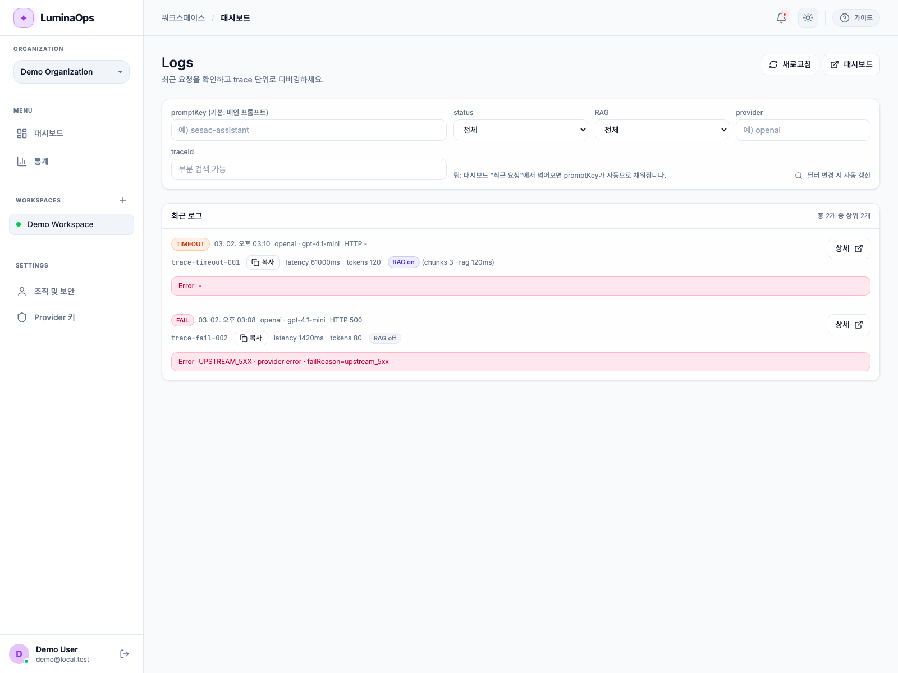
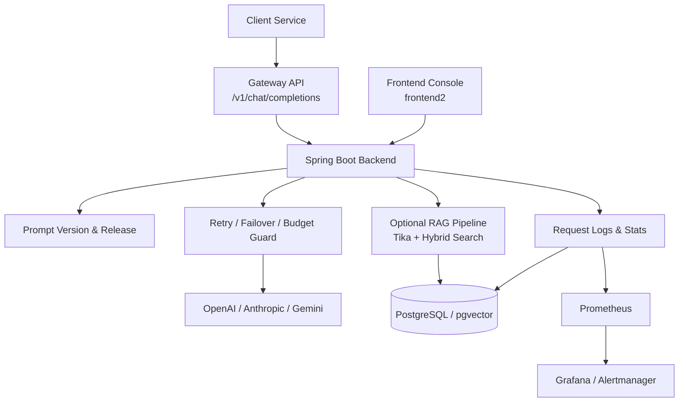

# LuminaOps

> 조직 단위로 LLM 호출을 표준화하고, 프롬프트를 안전하게 배포·롤백하며, 요청 단위의 비용·지연·오류를 추적할 수 있도록 설계한 LLMOps 플랫폼입니다.

## Demo & Links

- 서비스 소개: 준비 중
- 시연 영상: 준비 중
- 발표 자료: 준비 중
- API 문서: [사용자 가이드](./docs/USER_GUIDE.md)

## Preview

현재 레포에 커밋된 데모 자산 기준으로 Logs 화면을 우선 노출합니다. 발표용 GIF, 메인 화면 캡처, Dashboard 대표 이미지는 정리 후 추가하는 구성이 가장 자연스럽습니다.

### Logs / Timeout 대응 화면



## Why LuminaOps

여러 팀이 OpenAI, Claude, Gemini를 각자 다른 방식으로 호출하면

- 장애 대응 로직이 서비스마다 중복되고
- 프롬프트 배포와 롤백 이력이 분산되며
- 비용, 지연, 오류를 trace 단위로 추적하기 어려워집니다.

LuminaOps는 이 문제를 해결하기 위해 다음 3가지를 하나의 운영 흐름으로 묶었습니다.

- `One Gateway`
- `Prompt Versioning`
- `Logs & Dashboard`

즉, 프롬프트를 실험하고 배포한 뒤 실제 요청을 Gateway에서 안정적으로 처리하고, 문제가 생기면 로그와 대시보드로 원인을 추적해 다시 롤백할 수 있는 운영 루프를 만드는 것이 목표입니다.

## Core Features

### 1. One Gateway

- OpenAI 호환 단일 엔드포인트 `POST /v1/chat/completions`
- `X-API-Key` 기반의 워크스페이스 인증
- provider/model 단위 circuit breaker 적용
- timeout, 5xx는 same-provider retry 후 failover
- 429, model not found는 즉시 failover
- `error_code`, `fail_reason`, `traceId` 기반의 표준 오류 응답

### 2. Prompt Playground & Versioning

- Prompt 생성 및 버전 관리
- Playground에서 프롬프트/파라미터 실험
- Release를 통한 active 버전 전환
- Rollback을 통한 이전 버전 복구
- 확장 기능으로 Prompt 평가 탭 제공

### 3. Logs & Dashboard

- 요청/응답/오류/토큰/비용/지연 추적
- `traceId` 기준 로그 상세 조회
- Workspace 최근 요청, 예산 사용량, 운영 상태 확인
- Prometheus/Grafana 기반 지표 관측
- 실패 원인 분류를 위한 표준 error code 정책 적용

### 4. Optional RAG

- 문서 업로드와 미리보기
- Tika 기반 추출 및 청킹
- pgvector + keyword 기반 hybrid search
- Workspace 단위 RAG 설정 관리

## Architecture



### Request Flow

1. 콘솔에서 프롬프트를 생성하고 버전을 저장합니다.
2. Release로 활성 버전을 전환합니다.
3. 외부 서비스는 `X-API-Key`와 함께 Gateway를 호출합니다.
4. Gateway는 요청 시간 예산 안에서 retry와 failover를 수행합니다.
5. 결과는 `traceId` 기준으로 로그와 대시보드에 연결됩니다.
6. 이상 징후가 보이면 로그 상세를 보고 원인을 추적한 뒤 롤백합니다.

## Tech Stack

### Backend

- Java 17
- Spring Boot 3.5.9
- Spring Data JPA
- Spring Security
- Flyway
- Resilience4j
- Spring AI
- Google GenAI SDK

### Frontend

- React 19
- TypeScript
- Vite
- React Query
- Tailwind CSS

### Infra / Observability

- PostgreSQL
- pgvector
- Prometheus
- Grafana
- Alertmanager
- S3-compatible storage
- Apache Tika
- Docker Compose

### Test / Performance

- JUnit 5
- Mockito
- Vitest
- Artillery

## Team & Role

| 이름 | 역할 | 담당 |
| --- | --- | --- |
| 허지우 | 팀장 · Backend | Gateway / LLM·RAG, 외부 API 게이트웨이 구현, RAG 컨텍스트 검색·주입, Provider 키/게이트웨이 키 관리 |
| 홍찬용 | Frontend · Console Ops | 조직·워크스페이스 관리, 프롬프트 생성 / 버전 / 배포, CI/CD · AWS 배포 구성 |
| 박준하 | Backend · Observability | 로그인/회원가입 + Spring Security(JWT), 요청 로그/Trace 조회, 비용/사용량 대시보드(통계) |

## My Contributions

- 팀장 및 백엔드 개발 담당
- LLM 단일 게이트웨이 구조 설계 및 공급자 통합 호출 흐름 구현
- 프롬프트 평가 시스템 및 운영 로그 추적 구조 설계
- 장애 대응 흐름 및 예산 제한 정책 설계
- 팀 내 설계 의도와 코드 맥락 공유, 구현 방향 조율

## Reliability & Performance

### Reliability Policy

- `429`, `MODEL_NOT_FOUND`: immediate failover
- `timeout`, `5xx`, 일시적 네트워크 오류: same-provider retry 후 failover
- `400`, `401`, `403`, `413`, `415`, `422`, 정책 위반: fail-fast
- 전역 요청 시간 예산과 provider/model 단위 circuit breaker 적용

### Performance Test

- 도구: Artillery
- 대상: `/v1/chat/completions`
- 기준선 시나리오: `1 -> 5 -> 10 rps`, 총 11분
- 스파이크 시나리오: `1 -> 20 rps`
- 지속 부하와 budget/failover 검증 시나리오 포함

자세한 시나리오와 해석 기준은 [성능 테스트 가이드](./performance-tests/README.md)에서 확인할 수 있습니다.

## Run Locally

```bash
set -a; source .env.local; set +a
./gradlew bootRun --args='--spring.profiles.active=local'

cd frontend2
npm install
npm run dev
```

### Test

```bash
./gradlew clean test

cd frontend2
npm run test
npm run build
```

### Monitoring

```bash
docker compose -f docker-compose.monitoring.yml up -d
```

## Docs

- [사용자 가이드](./docs/USER_GUIDE.md)
- [Gateway 로그 흐름](./docs/request-log-flow.md)
- [Gateway 오류 코드 정책](./docs/gateway-error-code-policy.md)
- [성능 테스트 가이드](./performance-tests/README.md)

## Retrospective

### 왜 이런 구조를 선택했는가

- LLM 기능 자체보다 운영 안정성과 관측 가능성을 우선해야 실제 서비스에 붙일 수 있다고 판단했습니다.
- Gateway, Prompt, Logs를 분리된 기능이 아니라 하나의 운영 루프로 연결하는 데 집중했습니다.
- RAG는 핵심 가치가 아니라 확장 기능으로 배치해 MVP 범위를 통제했습니다.

### 상용화 전 보완 포인트

- Demo 링크와 대표 화면을 더 정리해 첫 인상을 강화할 필요가 있습니다.
- Team / My Contributions 섹션을 실제 참여 기준으로 확정해야 합니다.
- 운영 지표에 대한 정량 결과와 회고를 추가하면 채용용 문서로 더 강해집니다.
