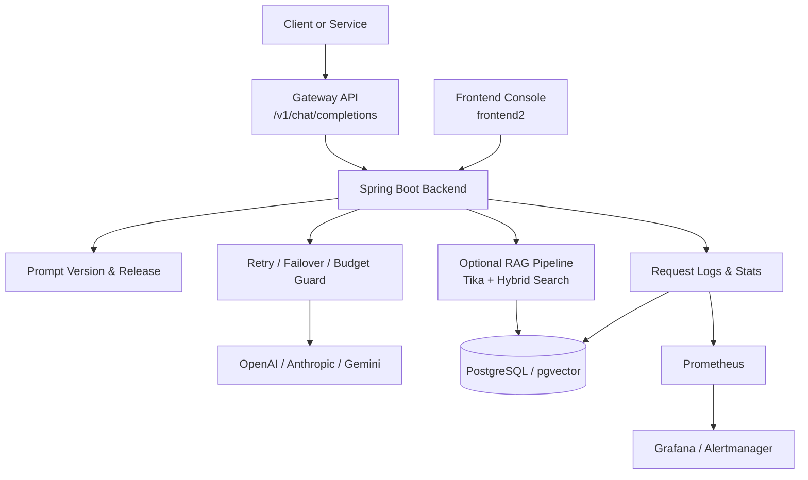

# LuminaOps

> 조직 단위로 LLM 호출을 표준화하고, 프롬프트 배포/롤백과 운영 관측을 연결하는 LLMOps 플랫폼

LuminaOps는 여러 LLM provider를 하나의 Gateway로 통합하고, 프롬프트를 안전하게 배포하며, 요청 단위 로그와 대시보드로 장애를 추적할 수 있도록 만든 팀 프로젝트입니다.

## 왜 만들었나

LLM을 실제 서비스에 붙이면 기능 구현보다 운영 문제가 먼저 드러납니다.

- provider마다 API와 오류 형식이 달라 호출 계층이 빠르게 복잡해짐
- 프롬프트 수정 후 어떤 버전이 실제 서비스에 반영됐는지 추적하기 어려움
- timeout, 429, 5xx가 발생했을 때 원인 파악과 롤백이 느려짐
- 비용, 지연, 실패율을 한 번에 보는 운영 화면이 부족함

LuminaOps는 이 문제를 해결하기 위해 다음 3축에 집중했습니다.

- `One Gateway`: `/v1/chat/completions` 단일 진입점으로 모델 호출 표준화
- `Prompt Ops`: Playground, 버전 저장, Release, Rollback
- `Logs & Dashboard`: `traceId` 기반 추적, 비용/지연/오류 관측

## 핵심 기능

| 영역 | 제공 기능 | 구현 포인트 |
| --- | --- | --- |
| Gateway | OpenAI 호환 단일 엔드포인트 | `/v1/chat/completions`, `X-API-Key` 기반 호출 |
| Reliability | retry, failover, circuit breaker, request budget | timeout/429/5xx 상황별 재시도 및 provider 우회 |
| Prompt Ops | 프롬프트 생성, 버전 관리, release/rollback, playground | 실제 서비스 반영 버전을 안전하게 전환 |
| Observability | 요청 로그, trace 상세, 대시보드, Prometheus/Grafana | 성공률, 오류율, latency, token, cost 추적 |
| Optional RAG | 문서 업로드, chunking, pgvector 검색, hybrid search | 운영 중심 MVP를 해치지 않는 확장 기능 |

## 아키텍처



## 운영 흐름

1. 콘솔에서 프롬프트를 생성하고 버전을 저장합니다.
2. Release로 활성 버전을 전환합니다.
3. 외부 서비스는 `X-API-Key`와 함께 Gateway를 호출합니다.
4. Gateway는 요청 예산 안에서 retry/failover를 수행합니다.
5. 모든 요청은 `traceId` 기준으로 로그와 대시보드에 축적됩니다.
6. 장애가 발생하면 로그 상세와 에러 코드로 원인을 추적하고, 필요 시 prompt release를 rollback 합니다.

## 기술 스택

| 구분 | 스택 |
| --- | --- |
| Backend | Java 17, Spring Boot 3.5.9, Spring Data JPA, Spring Security, Flyway |
| AI / Gateway | Spring AI, Google GenAI SDK, Resilience4j |
| Frontend | React 19, TypeScript, Vite, React Query, Tailwind CSS |
| Database | PostgreSQL, pgvector, H2(test) |
| Observability | Micrometer, Prometheus, Grafana, Alertmanager |
| Storage | S3-compatible object storage, Apache Tika |
| Test / Perf | JUnit 5, Mockito, Vitest, Artillery |

## 주요 포인트

### 1. One Gateway

- OpenAI 호환 API 하나로 여러 provider를 라우팅합니다.
- 오류를 `error_code`, `fail_reason`, `error_message`로 표준화합니다.
- 전체 요청 시간 예산 안에서 same-provider retry와 secondary failover를 수행합니다.
- provider/model 단위 circuit breaker로 장애 구간을 빠르게 우회합니다.

### 2. Prompt Playground + Versioning

- 프롬프트 단위를 만들고 버전을 누적 관리합니다.
- release 상태를 통해 실제 서비스 반영 버전을 분리합니다.
- Playground에서 system prompt, user template, model config를 실험할 수 있습니다.
- 평가 탭과 문서 기능은 확장 기능으로 함께 제공됩니다.

### 3. Logs + Dashboard

- 각 요청은 `traceId`로 연결되어 로그 상세에서 추적됩니다.
- latency, token, provider, model, RAG 여부, 비용 정보를 함께 확인할 수 있습니다.
- Workspace 대시보드에서 최근 요청, 예산 사용량, 운영 상태를 한 번에 볼 수 있습니다.
- Prometheus/Grafana와 연결해 운영 지표를 별도로 시각화할 수 있습니다.

## 주요 화면

### Logs 화면 예시

장애 상황에서 timeout, upstream error, provider, model, trace 정보를 빠르게 확인할 수 있도록 구성했습니다.


## API 예시

```bash
curl -X POST http://localhost:8080/v1/chat/completions \
  -H "Content-Type: application/json" \
  -H "X-API-Key: YOUR_WORKSPACE_API_KEY" \
  -d '{
    "model": "customer-support-bot",
    "messages": [
      { "role": "user", "content": "환불 정책을 알려줘" }
    ]
  }'
```

## 빠른 실행

### 1. Backend

```bash
set -a; source .env.local; set +a
./gradlew bootRun --args='--spring.profiles.active=local'
```

### 2. Frontend

```bash
cd frontend2
npm install
npm run dev
```

### 3. Test

```bash
./gradlew clean test

cd frontend2
npm run test
npm run build
```

### 4. Monitoring

```bash
docker compose -f docker-compose.monitoring.yml up -d
```

## 레포 구성

```text
.
├── src/                  # Spring Boot backend
├── frontend2/            # 메인 React 프론트엔드
├── frontend/             # 레거시 프론트엔드
├── monitoring/           # Prometheus / Grafana / Alertmanager 설정
├── performance-tests/    # Artillery 성능 테스트 시나리오
├── docs/                 # 사용자 가이드 및 운영 문서
└── ppt/                  # 발표 자료 및 데모 이미지
```

## 참고 문서

- [사용자 가이드](./docs/USER_GUIDE.md)
- [Gateway 로그 흐름](./docs/request-log-flow.md)
- [Gateway 오류 코드 정책](./docs/gateway-error-code-policy.md)
- [성능 테스트 가이드](./performance-tests/README.md)

## 프로젝트 메모

- 메인 프론트엔드는 `frontend2`이며 `frontend`는 레거시 디렉토리입니다.
- MVP의 중심은 RAG 챗봇 자체보다 `Gateway`, `Prompt Ops`, `Logs + Dashboard`입니다.
- RAG와 Prompt 평가는 확장 기능으로 제공됩니다.
