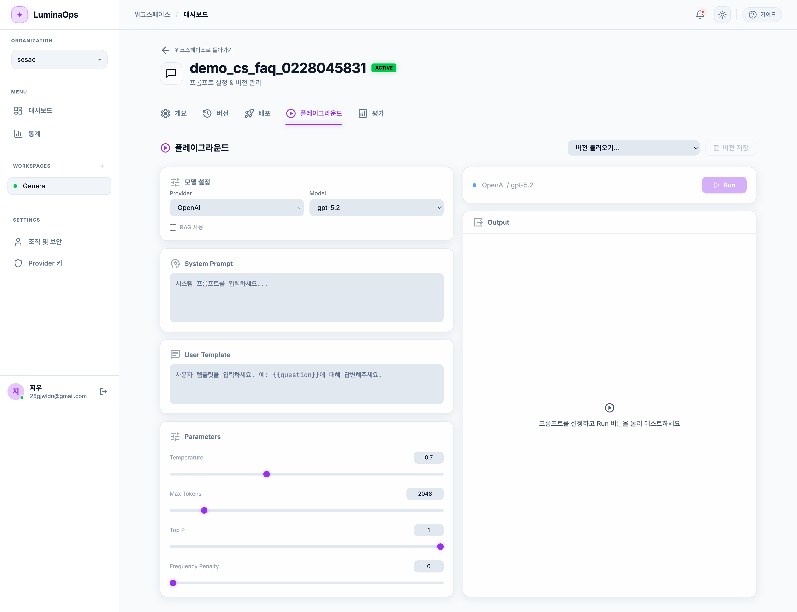
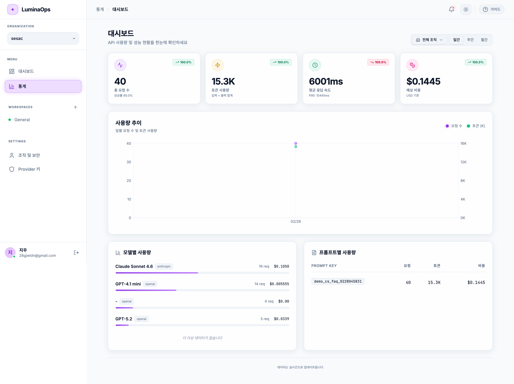
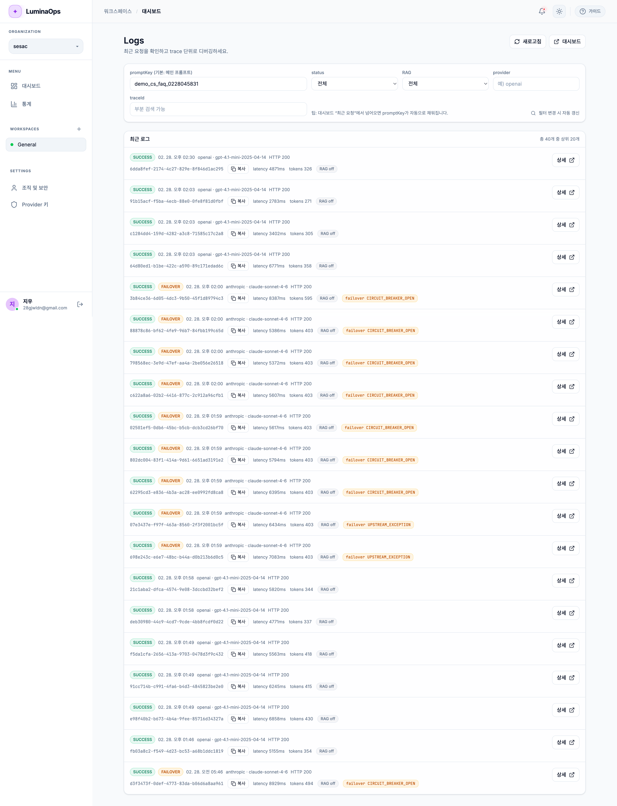
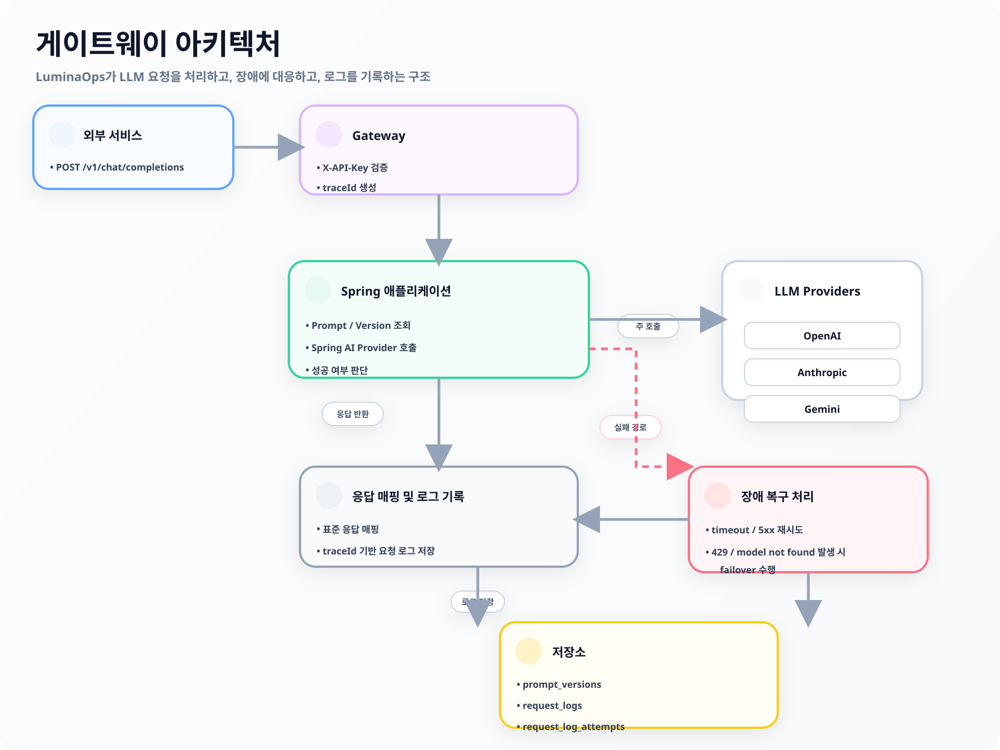
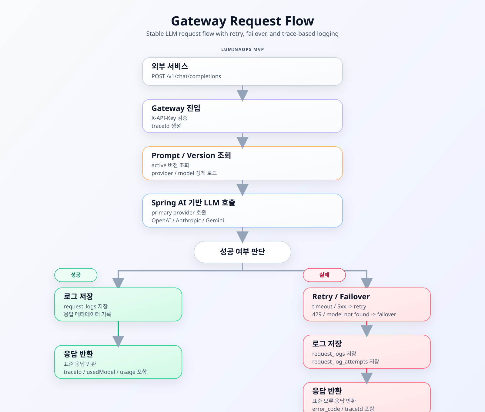

# LuminaOps

> 조직 단위로 LLM 호출을 표준화하고, 프롬프트를 안전하게 배포·롤백하며, 요청 단위의 비용·지연·오류를 추적할 수 있도록 설계한 LLMOps 플랫폼입니다.

## 어떤 문제를 해결하는가

LLM 기능을 실제 서비스에 붙이는 순간, 모델 성능보다 먼저 운영 문제가 드러납니다.
모델마다 호출 방식이 다르고, 장애 대응 로직은 서비스마다 흩어지며, 프롬프트 변경 이력과 실제 운영 로그가 분리되면 배포 이후 어떤 버전이 어떤 응답과 비용을 만들었는지 빠르게 설명하기 어렵습니다.

LuminaOps는 이런 문제를 해결하기 위해, RAG 중심 챗봇 빌더가 아니라 운영 안정성과 가시성에 초점을 맞춘 LLMOps 흐름을 설계했습니다.

- `LLM 호출 운영 리스크`
  429, timeout, 5xx 같은 장애가 발생하면 서비스별로 retry와 failover를 중복 구현해야 합니다.
- `프롬프트 버전 관리 부재`
  변경 이력과 active 버전이 명확하지 않으면 배포 후 rollback 판단이 늦어집니다.
- `운영 가시성 한계`
  traceId 기준 추적이 없으면 요청 단위의 비용, 지연, 오류, 사용 모델을 한 번에 분석하기 어렵습니다.

## 핵심 가치

### 1. One Gateway

- OpenAI 호환 단일 엔드포인트 `POST /v1/chat/completions`
- `X-API-Key` 기반 워크스페이스 인증
- provider/model 단위 circuit breaker
- timeout, 5xx는 same-provider retry 후 failover
- 429, model not found는 즉시 failover
- `error_code`, `fail_reason`, `traceId` 기반 표준 오류 응답

### 2. Prompt Playground & Versioning

- Playground에서 프롬프트와 파라미터를 빠르게 실험
- 버전 저장 후 immutable 이력 관리
- Release를 통해 active 버전 전환
- Rollback으로 이전 버전 즉시 복구

### 3. Logs & Dashboard

- `traceId` 기준 요청 상세 추적
- 요청, 응답, 오류, 토큰, 비용, 지연 통합 조회
- request 로그와 attempt 로그를 분리 저장
- 운영 지표를 통해 이상 징후를 빠르게 감지

## 미리보기

### 1. Playground에서 프롬프트를 빠르게 실험

Prompt Playground에서는 프롬프트 템플릿과 파라미터를 바로 조정하고, 선택한 provider와 model 조합으로 즉시 테스트할 수 있습니다.
실험 결과를 바탕으로 버전을 저장하고 release 하기 전까지 운영 환경과 분리된 상태에서 안전하게 검증할 수 있습니다.

### 2. Dashboard에서 비용과 성능을 한눈에 확인

Dashboard는 총 요청 수, 토큰 사용량, 평균 응답 속도, 예상 비용을 하나의 화면에서 제공합니다.
모델별 사용량과 프롬프트별 사용량을 함께 보여주기 때문에, 어떤 모델과 어떤 프롬프트가 운영 비용과 지연에 영향을 주는지 빠르게 파악할 수 있습니다.

### 3. Logs에서 정상 응답과 Failover 흐름을 함께 추적

Logs 화면에서는 정상 요청과 failover 요청을 같은 목록 안에서 비교할 수 있습니다.
특히 `CIRCUIT_BREAKER_OPEN`, `UPSTREAM_EXCEPTION` 같은 실패 원인과 failover 여부가 함께 기록되어, 장애 발생 시 어떤 provider에서 어떤 대체 경로로 응답이 반환되었는지 trace 단위로 확인할 수 있습니다.

## 아키텍처

### 서비스 아키텍처

### Gateway Request Flow

1. 외부 서비스가 `X-API-Key`와 함께 Gateway를 호출합니다.
2. Gateway는 API Key를 검증하고 `traceId`를 생성합니다.
3. active prompt version과 provider/model 정책을 조회합니다.
4. primary provider를 먼저 호출합니다.
5. timeout, 5xx, 429, model not found 같은 실패 유형에 따라 retry 또는 failover를 수행합니다.
6. 결과는 `request_logs`, `request_log_attempts`와 함께 저장되고 최종 응답으로 반환됩니다.

## 기술 스택

### Backend

- Java 17
- Spring Boot 3.5.9
- Spring Data JPA
- Spring Security
- Flyway
- Resilience4j
- Spring AI
- Google GenAI SDK

### Frontend

- React 19
- TypeScript
- Vite
- React Query
- Tailwind CSS

### Infra & Observability

- PostgreSQL
- pgvector
- Prometheus
- Grafana
- Alertmanager
- Docker

### Test

- JUnit 5
- Mockito
- Vitest
- Artillery

## 팀 소개 및 역할

| 이름 | 역할 | 담당 |
| --- | --- | --- |
| 허지우 | 팀장 · Backend | Gateway 호출 흐름, Retry/Failover 정책, Prompt 운영 구조, LLM Provider 연동 |
| 홍찬용 | Backend · Infra | Prompt·Workspace·Organization 도메인 설계·구현, AWS EC2·RDS·ALB 배포 |
| 박준하 | Backend · Observability | 요청 로그/Trace 조회, 통계 대시보드, 인증 및 보안 영역 |
