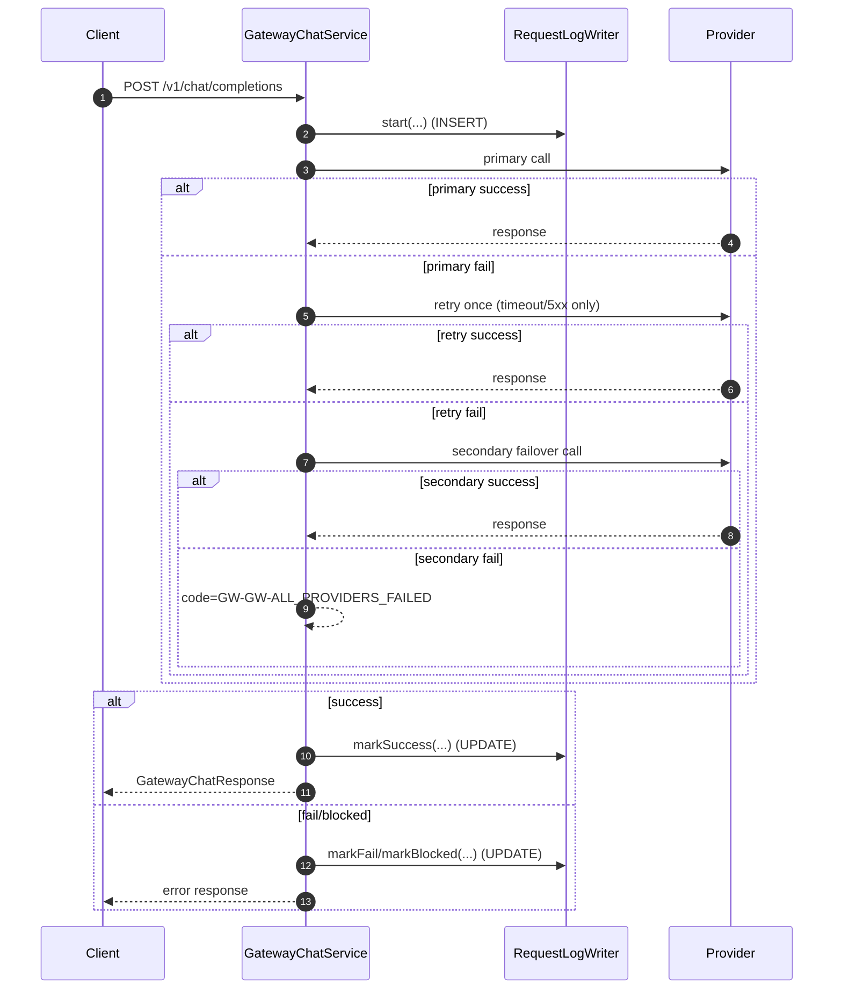

# Request Log Flow (Gateway)

현재 코드는 `request_logs` 스키마를 유지하면서, 실패 원인을 표준 코드로 기록합니다.

## 1) 핵심 요약

1. 시작 시 `start()`로 `IN_PROGRESS` 동기 INSERT
2. 처리 성공 시 `markSuccess()` 비동기 UPDATE
3. 실패/차단 시 `markFail()/markBlocked()` 비동기 UPDATE
4. 실패 표준화 규칙:
5. `error_code`: 표준 Gateway 코드 (예: `GW-UP-RATE_LIMIT`)
6. `fail_reason`: 상세 원인 (예: `HTTP_503`, `SOCKET_TIMEOUT`, `MODEL_404`)
7. `error_message`: 사용자 안내 문구

## 2) 필드별 저장 시점

### A. 시작 INSERT (`RequestLogWriter.start`)

채움:
1. `request_id`, `trace_id`
2. `organization_id`, `workspace_id`, `api_key_id`, `api_key_prefix`
3. `request_path`, `http_method`, `prompt_key`, `rag_enabled`
4. `status = IN_PROGRESS`, `currency = USD`, `created_at`

### B. 성공 UPDATE (`RequestLogWriter.markSuccess`)

채움:
1. `status = SUCCESS`, `http_status = 200`, `finished_at`, `latency_ms`
2. `provider`, `requested_model`, `used_model`, `is_failover`
3. `input_tokens`, `output_tokens`, `total_tokens`
4. `estimated_cost`, `pricing_version`
5. RAG 메트릭(`rag_*`)

### C. 실패 UPDATE (`RequestLogWriter.markFail`)

채움:
1. `status = FAIL`, `http_status`, `finished_at`, `latency_ms`
2. `error_code` (표준 코드)
3. `fail_reason` (상세 원인)
4. `error_message` (사용자 안내 문구)
5. 가능한 경우 `provider/requested_model/used_model/is_failover`
6. 가능한 경우 토큰/비용/RAG 메트릭

### D. 차단 UPDATE (`RequestLogWriter.markBlocked`)

채움:
1. `status = BLOCKED`
2. `error_code` / `fail_reason` / `error_message`
3. 기타 실패와 동일한 메타 필드

## 3) Failover/Retry 반영 방식

1. 즉시 failover:
2. `GW-UP-RATE_LIMIT`, `GW-UP-MODEL_NOT_FOUND`
3. 1회 retry 후 failover:
4. `GW-UP-TIMEOUT`, `GW-UP-UNAVAILABLE`
5. fail-fast:
6. `GW-REQ-*`, `GW-GW-POLICY_BLOCKED`
7. 모든 경로 실패:
8. `error_code = GW-GW-ALL_PROVIDERS_FAILED`

## 3-1) 전역 시간예산 초과 기록 예시

1. 상황: primary 실패 후 failover 가능한 코드였지만 남은 시간이 최소 failover 예산보다 작은 경우
2. 저장:
3. `error_code = GW-UP-TIMEOUT`
4. `fail_reason = REQUEST_DEADLINE_EXCEEDED`
5. `error_message = 요청 전체 처리 시간 한도를 초과했습니다.`

## 4) 시퀀스

