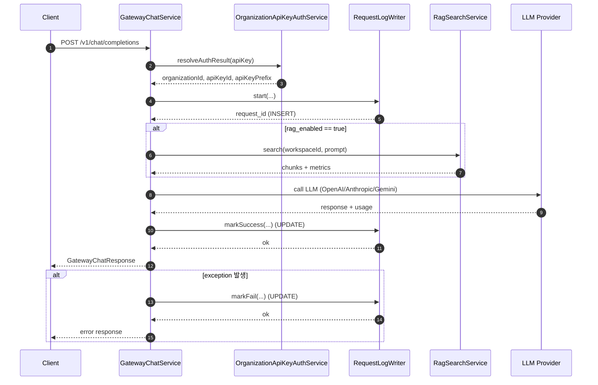

# Request Log Flow (Gateway)

아래 내용은 **현재 코드 기준**으로 `request_logs`가 **어떤 시점에 어떤 필드로 채워지는지**를
요청 흐름 순서대로 정리한 문서입니다.

## 1) 흐름 요약

1. 고객 요청 도착
2. 인증 및 초기 파라미터 계산
3. RequestLog **start (INSERT)**
4. 프롬프트 렌더링 / RAG 처리
5. 프로바이더 결정 및 LLM 호출
6. RequestLog **success/fail (UPDATE)**
7. 응답 반환

---

## 2) 필드별 저장 시점 (흐름 기준)

### A. 요청 시작 시 INSERT (`RequestLogWriter.start`)

저장 위치:
- `GatewayChatService.chat()` → `requestLogWriter.start(...)`
- `RequestLogWriter.start()` → `RequestLog.start()`

채워지는 필드:
- `request_id` (UUID 생성)
- `trace_id`
- `organization_id`
- `workspace_id`
- `api_key_id`
- `api_key_prefix`
- `request_path`
- `http_method`
- `prompt_key`
- `rag_enabled`
- `status = IN_PROGRESS`
- `currency = USD`
- `created_at` (DB 자동)

### B. 처리 중 계산 (DB 저장 전)

계산 위치:
- `GatewayChatService.chat()`

계산되는 값:
- `latency_ms` (요청 시작~끝)
- `rag_latency_ms`
- `rag_chunks_count`
- `rag_context_chars`
- `rag_context_truncated`
- `rag_context_hash`

### C. 성공 시 UPDATE (`RequestLogWriter.markSuccess`)

저장 위치:
- `GatewayChatService.chat()` → `requestLogWriter.markSuccess(...)`
- `RequestLogWriter.markSuccess()` →
  `fillModelUsage()` + `fillRagMetrics()` + `markSuccess()`

채워지는 필드:
- `status = SUCCESS`
- `finished_at`
- `http_status` (200)
- `latency_ms`
- `provider`
- `requested_model`
- `used_model`
- `is_failover`
- `input_tokens`
- `output_tokens`
- `total_tokens`
- `rag_latency_ms`
- `rag_chunks_count`
- `rag_context_chars`
- `rag_context_truncated`
- `rag_context_hash`

### D. 실패 시 UPDATE (`RequestLogWriter.markFail`)

저장 위치:
- `GatewayChatService.chat()` → `requestLogWriter.markFail(...)`
- `RequestLogWriter.markFail()` →
  `fillModelUsage()` + `fillRagMetrics()` + `markFail()`

채워지는 필드:
- `status = FAIL`
- `finished_at`
- `http_status`
- `latency_ms`
- `error_code`
- `error_message`
- `fail_reason`
- (가능 시) `provider`, `requested_model`, `used_model`, `is_failover`
- (가능 시) `input_tokens`, `output_tokens`, `total_tokens`
- `rag_latency_ms`
- `rag_chunks_count`
- `rag_context_chars`
- `rag_context_truncated`
- `rag_context_hash`

---

## 3) 현재 코드상 미사용/미채움 필드

- `prompt_id`, `prompt_version_id`
- `rag_top_k`, `rag_similarity_threshold`
- `estimated_cost`, `pricing_version`
- `input_tokens`, `output_tokens` (대부분 null로 남음)

---

## 4) 시퀀스 다이어그램 (Mermaid)

